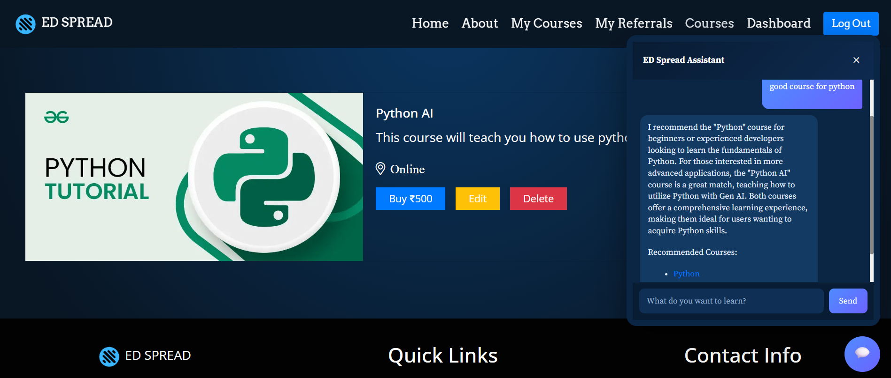
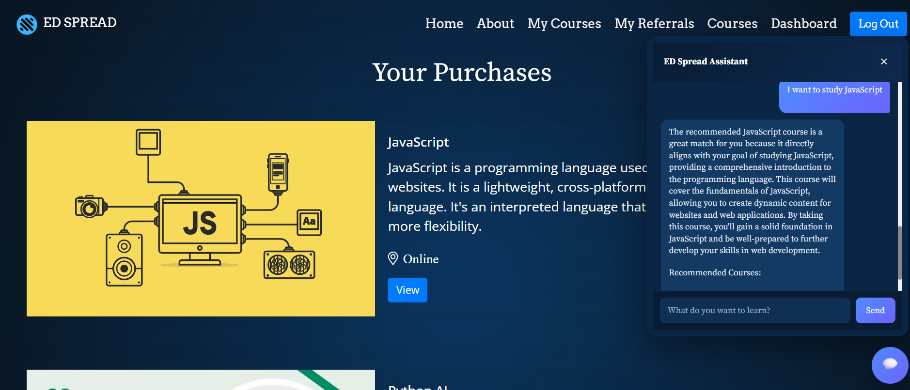

# 🚀 EdSpread – AI-Powered Course Recommendation Platform

**EdSpread** is a full-stack EdTech platform where admins can upload and manage courses, users can enroll using referral IDs, and an **AI-powered recommendation chatbot** suggests relevant courses using **semantic search, vector embeddings, machine learning re-ranking, and LLM-based explanations**.

This project showcases **modern full-stack engineering**, **Generative AI integration**, **vector databases**, and **machine learning-based recommendation systems**, making it ideal for recruiters reviewing practical AI projects.

---

## 🌐 Live Demo

🔗 **Frontend (Netlify):** https://edspread.netlify.app/

> Backend APIs are hosted on **Render**.

---

# ✨ Key Highlights

## 🤖 AI-Powered Course Recommendation System

EdSpread uses a **two-stage AI recommendation pipeline**:

1. **Semantic Retrieval**
   - Courses are converted into vector embeddings using an embedding model.
   - User queries are converted into embeddings.
   - MongoDB Atlas Vector Search retrieves semantically similar courses.

2. **Machine Learning Re-ranking**
   - Retrieved courses are passed through a Random Forest recommendation model.
   - The model predicts a recommendation probability using features such as:
     - Vector similarity score
     - Course price
     - Course type
     - Query length
     - Course title length

3. **LLM Explanation**
   - The top-ranked courses are sent to an LLM.
   - The chatbot generates personalized explanations for why each course matches the user's goal.

Example:

> User: "I want to learn backend development"

The system retrieves backend-related courses using semantic search, ranks them using ML, and generates a personalized recommendation explanation.

---

# 🧠 AI Chatbot Capabilities

* Conversational AI assistant for course discovery
* Understands user intent instead of relying on keyword matching
* Uses:
  - Vector embeddings
  - MongoDB Vector Search
  - Machine Learning re-ranking
  - LLM-generated explanations

The chatbot helps users discover suitable courses based on their learning objectives.

---

# 🏗️ System Architecture

             Frontend
          React + Netlify
                |
                v
      Node.js + Express Backend
                |
    -----------------------------
    |                           |
    v                           v

MongoDB Atlas ML Recommendation API
| |
| v
Course Metadata Random Forest Model
Embeddings |
| |
-----------+---------------
|
v
Groq LLM Explanation Layer
|
v
Personalized Recommendations

---

# 🔍 AI Recommendation Flow

User Query
|
v
Generate Query Embedding
|
v
MongoDB Atlas Vector Search
|
v
Retrieve Top 20 Similar Courses
|
v
Random Forest ML Re-ranking
|
v
Select Top Recommended Courses
|
v
LLM Generates Explanation
|
v
Final Recommendation

---

# 🧠 Machine Learning Recommendation Model

A Random Forest classifier is used as a ranking model after vector retrieval.

### Input Features

| Feature | Description |
|---------|-------------|
| Similarity Score | Semantic similarity from MongoDB Vector Search |
| Price | Course price |
| Type | Free/Paid course |
| Query Length | Number of words in user query |
| Title Length | Course title length |

### Output

The model predicts:

Recommendation Probability

Example:

Node.js Backend Course

Vector Similarity: 0.91

ML Recommendation Score: 0.96

This allows the system to combine semantic understanding with machine learning-based ranking.

---

# 👨‍💼 Admin Features

* Secure admin dashboard
* Add / update / delete courses
* Automatically generate course embeddings
* Manage course content
* View enrolled users
* Track referral-based signups

---

# 👤 User Features

* Browse available courses
* Enroll in courses
* Unique referral ID assigned to users
* Use referral IDs during signup
* AI chatbot for personalized course recommendations

---

# 🔗 Referral System

* Every user receives a unique referral ID
* New users can register using referral IDs
* Referral relationships are stored in the database
* Designed to support future reward systems

---

# 🧰 Tech Stack

## Frontend

* React.js
* CSS / Tailwind CSS
* Netlify

## Backend

* Node.js
* Express.js
* REST APIs
* Render

## Database

* MongoDB Atlas
* MongoDB Vector Search

## AI / ML

* Hugging Face Embedding Models
* Vector Embeddings
* Semantic Search
* Random Forest Recommendation Model
* Groq LLM API
* AI-powered chatbot

## Machine Learning Service

* Python
* Flask API
* Scikit-learn
* Joblib

---

# 🧪 AI Pipeline Details

### Course Upload

Admin uploads course
|
v
Generate embedding
|
v
Store embedding in MongoDB

### User Recommendation

User enters query
|
v
Generate query embedding
|
v
MongoDB Vector Search
|
v
Retrieve candidate courses
|
v
Random Forest ranking
|
v
LLM recommendation explanation

---

# 📌 Why This Project Matters

✔ Demonstrates **GenAI + Machine Learning + Full-Stack Development**

✔ Uses real vector database search instead of keyword matching

✔ Implements a production-style **retrieval + re-ranking architecture**

✔ Combines traditional ML with modern LLM systems

✔ Solves a real-world problem: personalized learning discovery

✔ Demonstrates scalable AI application design

---

# 🚀 Future Improvements

* Replace synthetic ML training data with real user interaction data
* Add user behavior-based recommendations
* Add course ratings and reviews
* Implement user learning history tracking
* Add payment gateway integration
* Add personalized chatbot memory
* Deploy ML model using Docker and cloud infrastructure

---

# 📄 License

This project is for educational and portfolio purposes.

---

# 👋 Author

**Samar Imam**

GenAI | Full-Stack Developer | AI Enthusiast

> This project demonstrates practical experience building AI-powered applications using vector databases, LLMs, machine learning models, and scalable backend architecture.

---

⭐ If you like this project, consider giving it a star!
